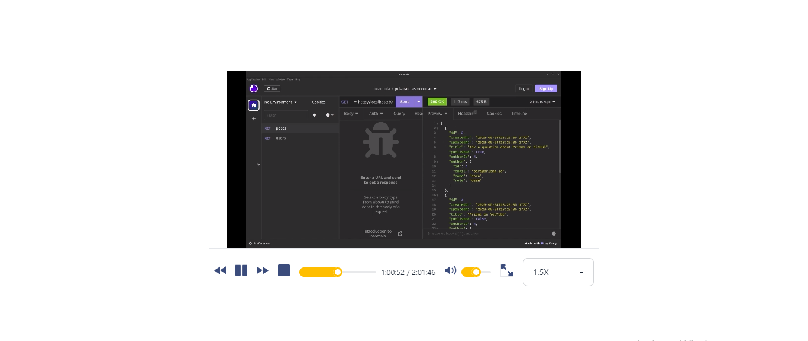

# Custom Video Player

A custom video player made from scratch using html5 features

## Table of contents

- [Table of contents](#table-of-contents)
- [Overview](#overview)
  - [Screenshot](#screenshot)
  - [Built with](#built-with)
- [Installation](#installation)
- [Acknowledgement](#acknowledgement)

## Overview

### Screenshot

### Built with

- Next.js
- Daisy UI
- Tailwind.css
- Mobile-first workflow

## Installation

- Clone repo into your drive
- cd into the repo
- run npm install on the terminal
- after installation of packages, npm run dev on the terminal

## Resources
- [HtmlMediaElement](https://developer.mozilla.org/en-US/docs/Web/API/HTMLMediaElement)
- [Html5 Video and Audio Apis](https://developer.mozilla.org/en-US/docs/Learn/JavaScript/Client-side_web_APIs/Video_and_audio_APIs)

